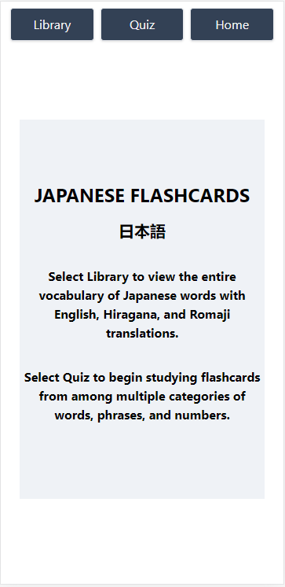

# Japanese Flashcards
  ## Description
    Japanese Flashcards is a React SPA (Single Page Application) that allows users to quiz themselves from among different categories of Japanese words and phrases, such as nouns, verbs, and numbers.
    A library page also displays the entire word bank of words that can be quizzed.  Users can select one or multiple categories and switch between the Japanese and English translations for each word or phrase,
    to really help solidify memorization.

  ## License
  

  ## Table of Contents
  1. [Installation](#Installation)
  2. [Deployment](#Deployment)
  3. [Usage](#Usage)
  4. [Screenshot](#Screenshot)
  5. [Contributing](#Contributing)
  6. [Technologies](#Technologies)
  7. [Tests](#Tests)
  8. [Questions](#Questions)

  ## Installation
  No installation is required to run this project.  Simply view the Deployment link to see the app.

  ## Deployment
  https://lumberjon1.github.io/JapaneseFlashcards/

  ## Usage
  Navigate from home to either quizzes or the library, to try out memorizing various Japanese words and phrases.  Or look through the organized lists of vocabulary.

  ## Screenshot
  

  ## Contributing
  Please feel free to contact me if you have questions about contributing to this project.  Ypu can reach out via my email or GirHub account linked below.

  ## Technologies
  * Javascript
  * Node.js
  * React
  * TailwindCSS

  ## Tests
  No testing frameworks were used in the development of this project.

  ## Questions
  [Check out my GitHub](https://github.com/LumberJon1)
  --or--
  Email me at JWilliams12117@gmail.com